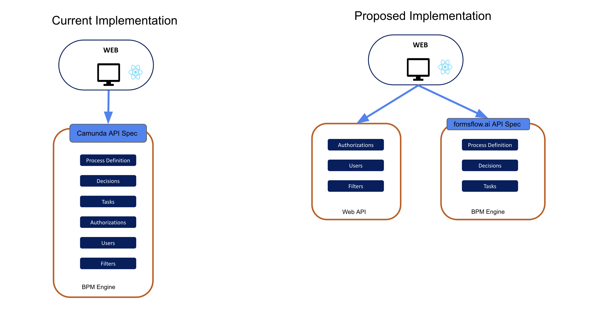

# BPM Abstraction

| Status        | (Proposed / Accepted / Implemented / Obsolete)       |
:-------------- |:---------------------------------------------------- |
| **RFC PR #**     | [NNN](https://github.com/AOT-Technologies/forms-flow-ai/pull/NNN) (update when you have PR #)|
| **Author(s)** | Sumesh Kariyil (sumesh.pk@aot-technologies.com) |

## Objective

Build an abstraction layer between BPM engine and other components

## Motivation

formsflow.ai currently relies on non-BPM features provided by BPM engine to fulfill some requirements.

## Design Proposal

- Come up with an API spec for the BPM ReST layer. [Ref](./bpm_abstraction/bpm_api_spec.yaml)
- Build an abstraction REST layer on the BPM engine to transform default requests and responses to match with API spec above.
- Change all components on formsflow.ai to work with a known API spec for BPM engine.
- Move non BPM features used from BPM engine to formsflow API.

### Alternatives Considered

### Performance Implications
- Some of the API calls to BPM may need to call Web API

### Dependencies

### Compatibility (Existing implementation Impact)
- Need to create migration scripts to move existing metadata in BPM layer to Web API.

## Detailed Design

TBD

## Thanks

Thanks to tensforflow, react RFC templates.