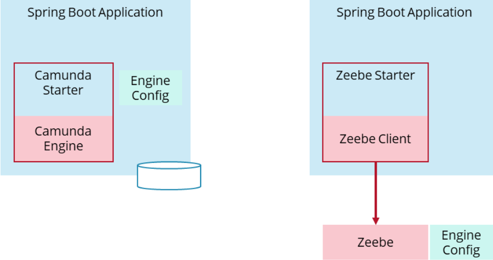

# Camunda 8 Upgrade Document

| Status        | (Proposed / Accepted / Implemented / Obsolete)       |
:-------------- |:---------------------------------------------------- |
| **RFC PR #**     | [#PR-3](https://github.com/AOT-Technologies/forms-flow-ai-rfcs/pull/3) |
| **Author(s)** | Shibin Thomas (shibin.thomas@aot-technologies.com) |


## Objective

This document discuss the upgrade / migration feasibility of formsflow.ai from camunda 7 to 8. Camunda is moving out from embedded process engine architecture
to remote process engines to bring more performance and design flexibility. formsflow.ai can benefit from these changes with improved performance and scalability.


## Motivation

Camunda is an integral part of the solution, most of the heavy lifting within the application performed by the process engines.
So to match with scalability requirement and design flexibility Camunda introduced a new Remote process engine model from Camunda 8 (not Camunda Run) onwards.
To match with the Camunda design changes and to benefit with the scalability and improved performance the upgrade (to Camunda 8) is essential.

When many number of users started accessing the system from our government implementations we observed a major spike in cpu usage and latency.
During the peak hours users were frustrated due to slowness in accessing task data and making any actions on the user task. Our team working with clients often
started sending us startling performance reports. Also, developers were finding it difficult to decouple the business logic from process engine.
Camunda 8 offers performance and maximum scalability with process engine separated from the actual business logic.

The current architecture looks like below.


## Design Proposal

With Camunda Platform 7, a frequently used architecture to build a process solution (also known as process applications) is composed out of:
```
    Java
    Spring Boot
    Camunda Spring Boot Starter with embedded engine
    Glue code implemented in Java Delegates (being Spring beans)
```
This is visualized on the left-hand side of the picture below. With Camunda Platform 8, a comparable process solution would look like the right-hand side of the picture and leverage:
```  
    Java
    Spring Boot
    Spring Zeebe Starter (embeding the Zeebe client)
    Glue code implemented as workers (being Spring beans)
```


The difference is that the engine is no longer embedded.

A typical deployment of the workflow engine itself looks different because the workflow engine is no longer embedded into your own deployment artifacts.

With Camunda Platform 7 a typical deployment includes:

1. Your Spring Boot application with all custom code and the workflow engine, cockpit, and tasklist embedded. This application is typically scaled to at least two instances (for resilience)
2. A relational database.
3. An elastic database (for Optimize).
4. Optimize (a Java application)

With Camunda Platform 8 you deploy:

1. Your Spring Boot application with all custom code and the Zeebe client embedded. This application is typically scaled to at least two instances (for resilience)
2. The Zeebe broker, typically scaled to at least three instances (for resilience)
3. An elastic database (for Operate, Taskliste, and Optimize)
4. Optimize, Operate, and Tasklist (each one is a Java application). You can scale those application to increase availability if you want.


The weakness of the embedded engine listed below.

* No isolation between the engine and the application. Troubleshooting gets harder, Libraries are mixed, and Rebuild and redeployment necessary are the major challenges.
* Complex configurations.

Upgrading from current version to Camunda 8 can bring along the following features / changes also.

* Camunda Platform 8 is always a remote resource for your application. Decoupling, Improved scaling patterns, and Easier getting started experience are the major benefits
* It only allows storage of primary data types or JSON as process variables.
* It uses FEEL language for expressions.

The high level architecture for the proposed solution will look like below.


This involves bringing up a remote engine powered in zeebe and the curresponding task list and cockpit. Also zeebe client need to be introduced in the
current architecture to rewrite listeners and other camunda specific instances.
Consumption of events using SpringEventListener will be in question since the system is no more embedded. However, i am sure alternative solutions are available for it.

### Alternatives Considered

The Camunda 8 is bringing a lot of changes for a Camunda 7 system, especially formsflow.ai depended on the current architecture. Camunda is recommending to its users that
for a remote engine user the Camunda 8 stack wll be an easy thing to implement due to its similarities. 

The default recommendation of camunda is also changing to remote engine, more concretely Camunda Run, as a workflow engine, external tasks, and the REST API (typically wrapped into a client for your programming language).
The stack looks like below image.


In this we will be moving out the process engine from Spring boot application and make it run as a remote service. This involves changing api's and the authentication, the current Spring boot application
will work as a client to connect to the remote engine. However, reasonable amount of change is required in all layers to bring in this architecture as well.
Consumption of events using SpringEventListener will be in question since the system is no more embedded. However, im am sure alternative solutions are available for it.

### Performance Implications

Camunda is promising drastic performance benefits with this change along with the scalability.

### Dependencies

* Custom Listeners.
* Separate authentication.
* Custom Tasklist.
* API Layer change.
* Websocket implementation change.
* Data / workflow migration.

### Compatibility (Existing implementation Impact)

The current implementation is relying on embedded architecture to implement it's listeners, websocket, custom task page etc.
Also, moving from Camunda 7 to 8 requires data migration as well along with workflow migration.
Though camunda provides plugins for the data migration it is not 100% ready and migration can be a painful process for our clients.

Since this involves cooperation from our clients and multiple iteration of tests the change upcoming will be a lot.


## Detailed Design

As per the document there are currently 2 design suggestions.
1. Upgrade from current version (7.15) to Camunda 8 and bring the remote engine with zeebe along with other changes.
2. Upgrade from current version (7.15) to camunda 7.17 and redesign the architecture to remote engine and be prepared for Camunda 8 in the future when it gets more stable.

## Thanks

Thanks to camunda for the documentation and images.

## Links

* [Embedded process engines - The rise](https://camunda.com/blog/2022/02/moving-from-embedded-to-remote-workflow-engines/)
* [What is Camunda 8?](https://docs.camunda.io/docs/components/concepts/what-is-camunda-platform-8/)
* [Camunda platform 8 - In Github](https://github.com/camunda/camunda-platform/tree/8.0.0)
* [Migrating from Camunda 7 - 8 How?](https://docs.camunda.io/docs/guides/migrating-from-camunda-platform-7/)
* [Camunda 7 users - What need to know?](https://camunda.com/blog/2022/04/camunda-platform-8-for-camunda-platform-7-users-what-you-need-to-know/)