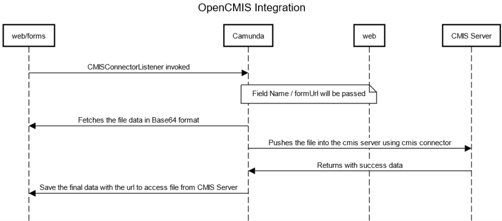
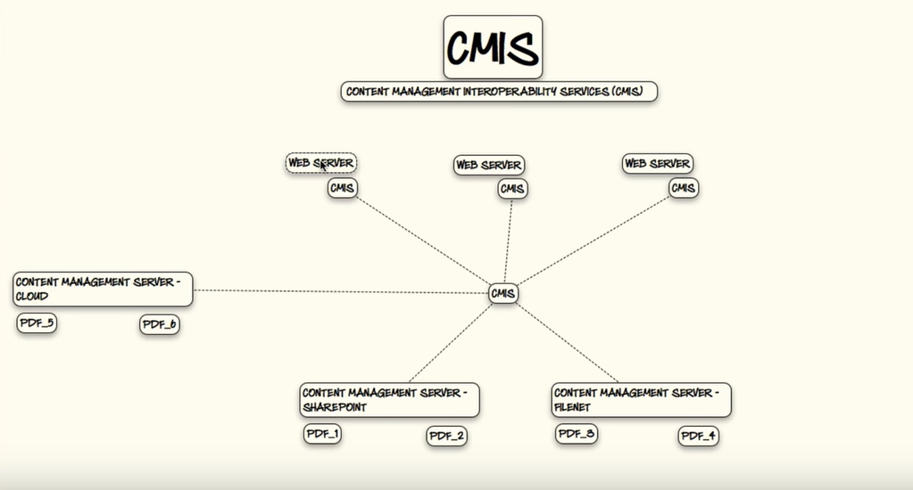

# Title of RFC

| Status        | (Proposed / Accepted / Implemented / Obsolete)       |
:-------------- |:---------------------------------------------------- |
| **RFC PR #**     | [NNN](https://github.com/AOT-Technologies/forms-flow-ai/pull/NNN) (update when you have PR #)|
| **Author(s)** | Shibin Thomas (shibin.thomas@aot-technologies.com) |

## Objective

formsflow.ai client wanted to store their metadata on CMS system, to enable that the system should support CMIS connector configuration.
CMIS connector can be configured with any CMS system which supports CMIS 1.1 or CMIS 1.0 specifications.

## Motivation

Storing the files eg: images, videos, pdf etc. on the file system is not a scalable solution. The workarounds on the file storage gets more tricky
when the system grows. CMIS comes into picture it can support the file storage without we write the infrastructure. Also, it can support the technology
change as it supports all the CMS systems which follows CMIS specifications.

Currently, form.io component supports storing the files in its database as Base64 format. It also supports file stored in cloud and other storage providers
but users those who want to use content management no solutions provided. To solve this technical limitation formsflow.ai will integrate a CMIS connector with
its component so users can easily configure their CMS systems.

## Design Proposal

The CMIS connector currently considered for this document is Apache chemistry. 
Apache chemistry provides integration options for mainstream development languages and it also provides OpenCMIS server using Java.
OpenCMIS connector for client can be easily integrated with the forms-flow-bpm component in formsflow.ai. The connection to server is
established using configurations which can be provided on server boot up. 

There are different options in which the OpenCMIS session can be established.

1. Rest API.
2. Camunda Java Listener class.

Both the options are configurable and high level functionality is depicted below.

In this approach when the user uploads a file in (Base64) and submits the camunda workflow pick up the file (using configurable Listener / Connector).
The Java connector will establish a session to put the file into a CMIS Server using the HTTP protocol (Rest). When the upload is completed the server will 
returns success message and the details will be updated back to form.io .
User can click on the form link and download the file from the repository (CMIS connector will be used here).

Front end can also build a component which can directly interact with Rest endpoint during submission. This component can be easily configured from the designer page.

A typical CMIS Architecture with the client - server association will look like this image.

CMIS connector from the front end is also exploring currently.

### Alternatives Considered

Currently the system doesn't have a CMIS connector and it is currently saving data on a no sql db. 
This can be a new feature and its upto the discussion weather we want the connector to contact server from the form itself or from the Java.
My recommendation is to establish a Rest API / Listener to contact CMIS server and OpenCMIS is a really good supporting library.

### Performance Implications

This need to be further evaluated

### Dependencies

List any dependencies in implementing this RFC.

### Compatibility (Existing implementation Impact)

* No compatibility issues identified, this can be introduced as a pluggable solution.

## Detailed Design

Refer the design proposal session.

## Thanks

Thanks to Alfresco, Apache chemistry.