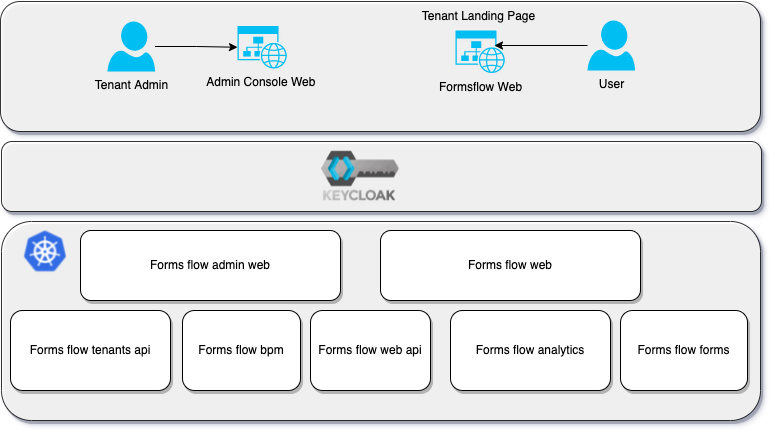
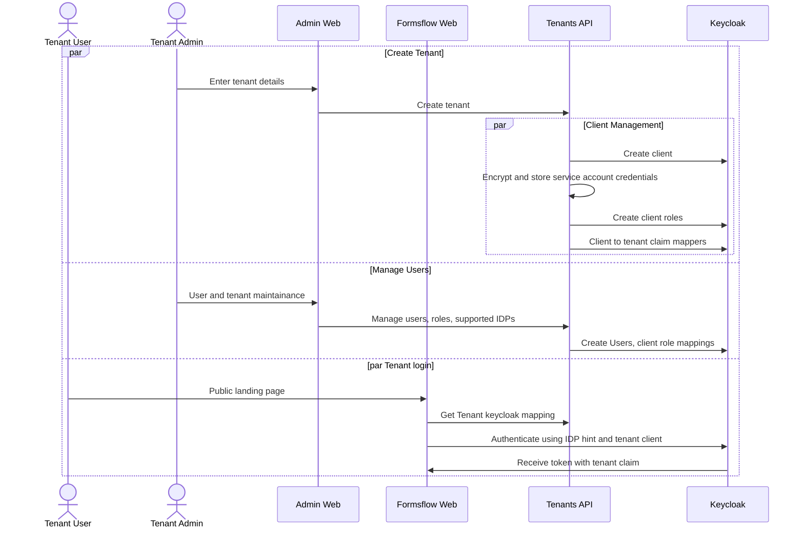

# Multi Tenancy

| Status        | (Proposed / Accepted / Implemented / Obsolete)       |
:-------------- |:---------------------------------------------------- |
| **RFC PR #**     | [NNN](https://github.com/AOT-Technologies/forms-flow-ai/pull/NNN) (update when you have PR #)|
| **Author(s)** | Sumesh Kariyil (sumesh.pk@aot-technologies.com) |

## Objective

Formsflow.ai currently doesn't support multi tenancy. This as a Request For Comments on the multi tenancy approach for formsflow.ai focusing on a phased approach.

## Motivation

Many customers around the world has raised the need for multi tenancy in formsflow.ai. Though the definition of multi tenancy varies by customer; I think we can cover a broad set of uses cases if we approach with a phased apprach.

- First Phase : Eeach tenant is integrated physically, but logically separated; meaning that a single instance of formsflow will serve multiple tenants.
- Second Phase : Multi tenancy with tenant level data and identity segragation. Data and identity stays separate for each tenant.

This RFC is intended for the first phase implementation.

## Design Proposal

Security is the highest priority when it comes to multi tenancy as we need to assure logical data segragation on each layer. Single realm with multiple client approach can be used on this phase to control tenant level authorization for the user.

Below are the changes on a high level;
- Admin console web : A new web application where the tenants are provisioned and managed. Tenant admin can submit tenant creation request after user signup.
- Tenants api : A new Restful API to maintain tenant information.
- Keycloak : All the users are managed under same realm; with authorizations under client. Client level authorization has to be implemented on keycloak. Each tenant would be mapped to a keycloak client and roles; and user roles managed under each client. Each access_token will contain Tenant-Id as a claim which will be used for tenant authorization for the user.
- Formsflow bpm : A new tenant is created on tenant provision; and any deployments would need the tenant ID. Keycloak client roles would need to be mapped as camunda bpm groups. 
- Formsflow Web API : Tenant identifier to mappers and add tenant based authorization. 
- Formsflow forms : Patch tenant id in each form or use project concept in form.io.
- Formsflow analytics : Create a new database user with tenant data permissions by creating a view created based on tenant identifiers. 
- BPMN web modeller to be integrated into form designer.

### Components 

### Flow diagram

### Alternatives Considered
- From a security point of view; adding the users to different groups were considered. Challenge with groups are they are on realm level and not on the client/application level. Found it to be hard to solution when same identity can be part of multiple tenants especially when they use an identity provider (e.g, google, facebook, github, BC Services Card etc.)

### Performance Implications
None at this moment.

### Dependencies

- Adding custom BPM listeners, java delegates and third party dependency per tenant are not in scope for this phase.

### Compatibility (Existing implementation Impact)
- To ensure backward compatibility; multi tenancy would be controlled by configuration properties. Existing application would work with a `default` tenant scope after implementing the changes.

## Detailed Design

TBD

## Thanks

Thanks to tensforflow, react RFC templates.