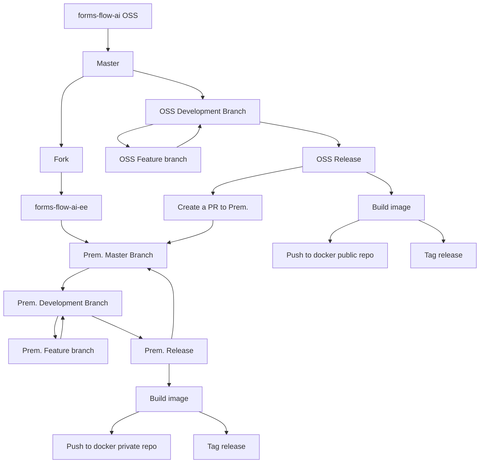

# Title of RFC

| Status        | (Proposed / Accepted / Implemented / Obsolete)       |
:-------------- |:---------------------------------------------------- |
| **RFC PR #**     |  |
| **Author(s)** | Sumesh Kaariyil (sumesh.pk@aot-technologies.com) |

## Objective
Selectively deliver features between public and premium users.

## Motivation

## Proposal

Currently formsflow.ai is single github [repository](https://github.com/aot-technologies/forms-flow-ai). Proposal is to fork the same repository into a closed repository for easy synchronization from open source to premium codebase.

## Challenges

Maintaining 2 separate codebase comes up with some challenges including;
- Database migration conflicts on merging open source code with premium code.
- Increased testing effort as every release has to be tested on both versions.
- More environments to be set up for dev and test.
- Structuring the code to have less impact on merge/upgrades.
